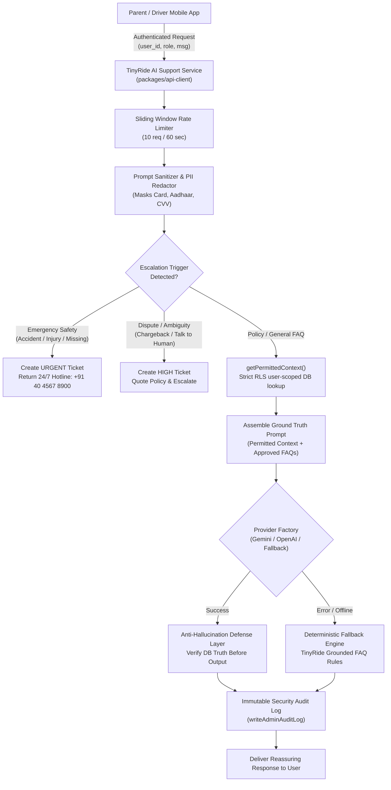

# TinyRide AI-004 Customer Support Assistant

## 1. Overview & Architecture

TinyRide's **AI-004 Customer Support Assistant** is a provider-independent, security-grounded AI helpdesk service designed for parents and drivers on the TinyRide school transport platform.

The system adheres strictly to the core principle: **Trust is earned through transparent processes, verified information, and dependable communication.** It enforces deterministic guardrails against hallucination and automatically routes sensitive, financial, and life-safety inquiries to human operations specialists.



---

## 2. Security Boundaries & Zero Direct Model Access

1. **No Raw Database Credentials**:
   - The LLM model is **never** given Supabase service_role keys or direct SQL execution access.
   - All dynamic context is pre-fetched by authenticated backend functions (`getPermittedContext(userId, role)`) scoped strictly to the authenticated caller's identity (`auth.uid() = user_id`).
2. **Context Minimization**:
   - Only permitted booking summaries, payment transaction statuses, and active route milestone timestamps are provided in the prompt.
   - PII, student medical notes, and unassigned child records are never shared with the model.
3. **Prompt Sanitization**:
   - All user inputs are sanitized before sending to LLMs:
     - 13–19 digit payment cards: `[REDACTED_CARD_NUMBER]`
     - 12-digit Indian Aadhaar IDs: `[REDACTED_AADHAAR]`
     - 3–4 digit CVVs: `[REDACTED_CVV]`
     - Hard character limit: 1,000 characters.

---

## 3. Anti-Hallucination Guardrails

Under PRD requirements, the AI assistant must never fabricate payment status, trip status, driver details, or safety information.

- **Payment Guard**: If the user asks whether their payment succeeded or why a fee was charged, but `recent_payments` is empty in their permitted context, the anti-hallucination defense immediately intercepts any model claim of payment receipt and directs them to the Billing tab.
- **Trip Status Guard**: If the user asks for vehicle location or arrival times, but `active_trip` is null in their context, the defense prevents false arrival claims and clarifies that live tracking activates 15 minutes prior to the pickup window.
- **Policy Grounding**: The system embeds the official approved knowledge base:
  - 5 Pilot Schools: Hyderabad Public School (Begumpet), Oakridge International (Gachibowli), Delhi Public School (Khajaguda), CHIREC International (Kondapur), Glendale Academy (Sun City).
  - Pricing: ₹2,500 – ₹4,500 per month prepaid, zero surge pricing.
  - Vehicle Capacity Caps: Auto-rickshaws: 4–6 children; Vans: 12–14 children (Telangana RTA regulations).
  - Driver KYC: Physical commercial DL, badge, Aadhaar, police verification certificate, and annual vehicle fitness certificate.
  - Refund Policy: 100% full refund before 1st of month; 5 business days notice for mid-month changes.

---

## 4. Human Escalation Protocols

| Escalation Type | Keywords Detected | Priority | Action Taken |
| :--- | :--- | :--- | :--- |
| **Emergency Safety** | `accident`, `crash`, `collision`, `hospital`, `emergency`, `ambulance`, `injury`, `missing child`, `breakdown`, `police` | `URGENT` | Immediate ticket creation, 24/7 Operations Command Center hotline (+91 40 4567 8900) & 112 emergency services provided directly in chat. |
| **Refund Dispute** | `dispute`, `chargeback`, `fraud`, `unauthorized`, `stolen card`, `scam`, `cheated`, `refund rejected` | `HIGH` | High-priority ticket created in Operations Desk, standard 5-day notice policy quoted, billing specialist assigned. |
| **Ambiguity / Request Human** | `speak to human`, `human agent`, `talk to person`, `customer care executive`, `call me back` | `MEDIUM` | Ticket created in Support Desk, operations specialist queued for callback. |

---

## 5. Provider-Independent Interface & Fallback

The assistant implements an interchangeable provider interface:

```typescript
export interface LLMProvider {
  readonly name: string;
  generateCompletion(
    messages: LLMMessage[],
    options?: LLMCompletionOptions
  ): Promise<LLMCompletionResult>;
}
```

Implemented providers:
1. **Google Gemini** (`GeminiProvider`): `gemini-1.5-flash` with low temperature (0.1) and system instructions.
2. **OpenAI Compatible** (`OpenAICompatibleProvider`): Standard `/chat/completions` schema compatible with OpenAI, DeepSeek, Groq, Ollama.
3. **Deterministic Fallback** (`DeterministicFallbackProvider`): Built-in regex rule engine and policy grounding. Executes instantly with 0ms network latency if external APIs fail or are unconfigured.

---

## 6. Required API Credentials & Environment Variables

| Variable Name | Required? | Description | Default / Example |
| :--- | :--- | :--- | :--- |
| `GEMINI_API_KEY` | Optional | Google Gemini AI Studio API key | `AIzaSy...` |
| `OPENAI_API_KEY` | Optional | OpenAI or compatible LLM key | `sk-proj-...` |
| `OPENAI_BASE_URL` | Optional | Custom endpoint for OpenAI-compatible models | `https://api.openai.com/v1` |
| `OPENAI_MODEL` | Optional | Target model name | `gpt-4o-mini` |
| `NEXT_PUBLIC_SUPABASE_URL` | Yes | Supabase Project URL | `https://orseixsidgyhqrkndxeb.supabase.co` |
| `NEXT_PUBLIC_SUPABASE_ANON_KEY` | Yes | Supabase Anonymous Client Key | Configured in `.env` |
| `SUPABASE_SERVICE_ROLE_KEY` | Server-only | Backend privilege key for audit log writes | Configured in server environment |

*Note: If no LLM API key is present in development or offline mode, the system automatically uses the Deterministic Fallback Engine without failing.*

---

## 7. Actual Integration Status

- [x] **Shared Types**: `AIAssistantMessage`, `PermittedUserContext`, `AIAssistantRequest`, `AIAssistantResponse` in `@tinyride/types`.
- [x] **Zod Validation**: `aiAssistantRequestSchema` in `@tinyride/validation`.
- [x] **LLM Layer**: `GeminiProvider`, `OpenAICompatibleProvider`, `DeterministicFallbackProvider` in `@tinyride/api-client`.
- [x] **FAQ Knowledge Base**: Pilot schools, Telangana RTA capacities, pricing, refund terms, driver KYC facts.
- [x] **Service Layer**: Scoped context retrieval, prompt sanitization, rate limiting, anti-hallucination defense, escalation tickets, audit logging.
- [x] **Supabase Edge Function**: `supabase/functions/ai-support-assistant/index.ts` with authentication verification, rate limiting, and escalation handling.
- [x] **Parent Mobile App**: Connected live in `apps/parent/app/(tabs)/support.tsx` with typing indicator, real-time responses, and escalation alert badges.
- [x] **Admin Dashboard Integration**: Support tickets created by AI assistant appear immediately in the Admin Support Desk (`apps/admin/app/support/page.tsx`).
- [x] **Automated Tests**: 16/16 Vitest tests passing in `packages/api-client/src/ai-support.test.ts`. Total suite: 117/117 passing tests.
