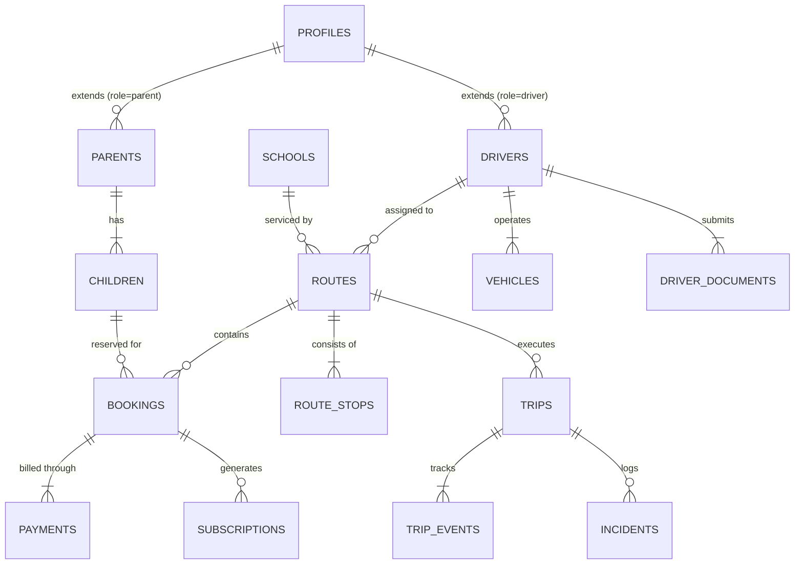
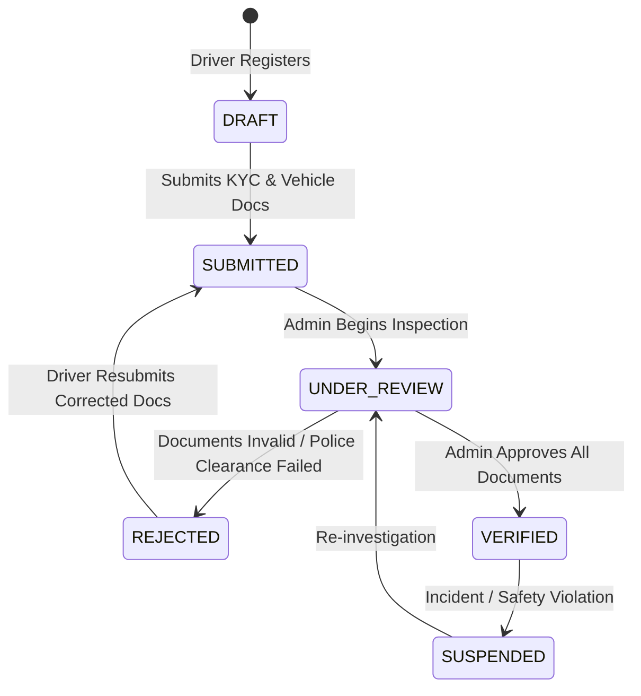
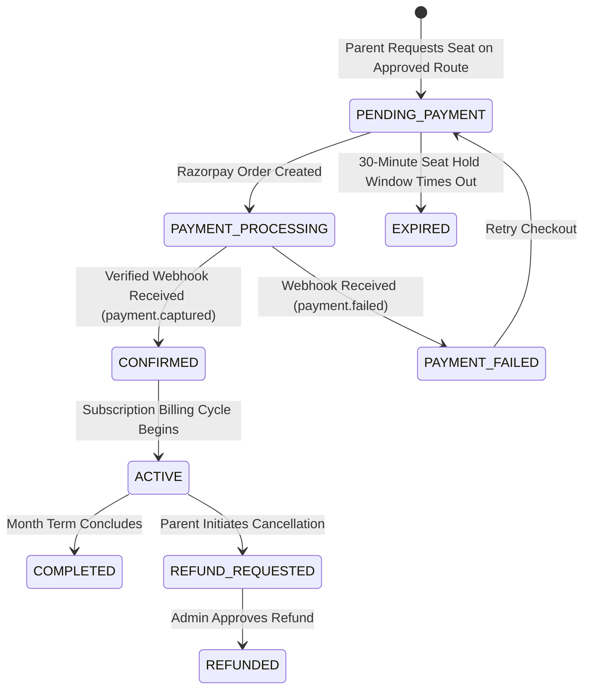
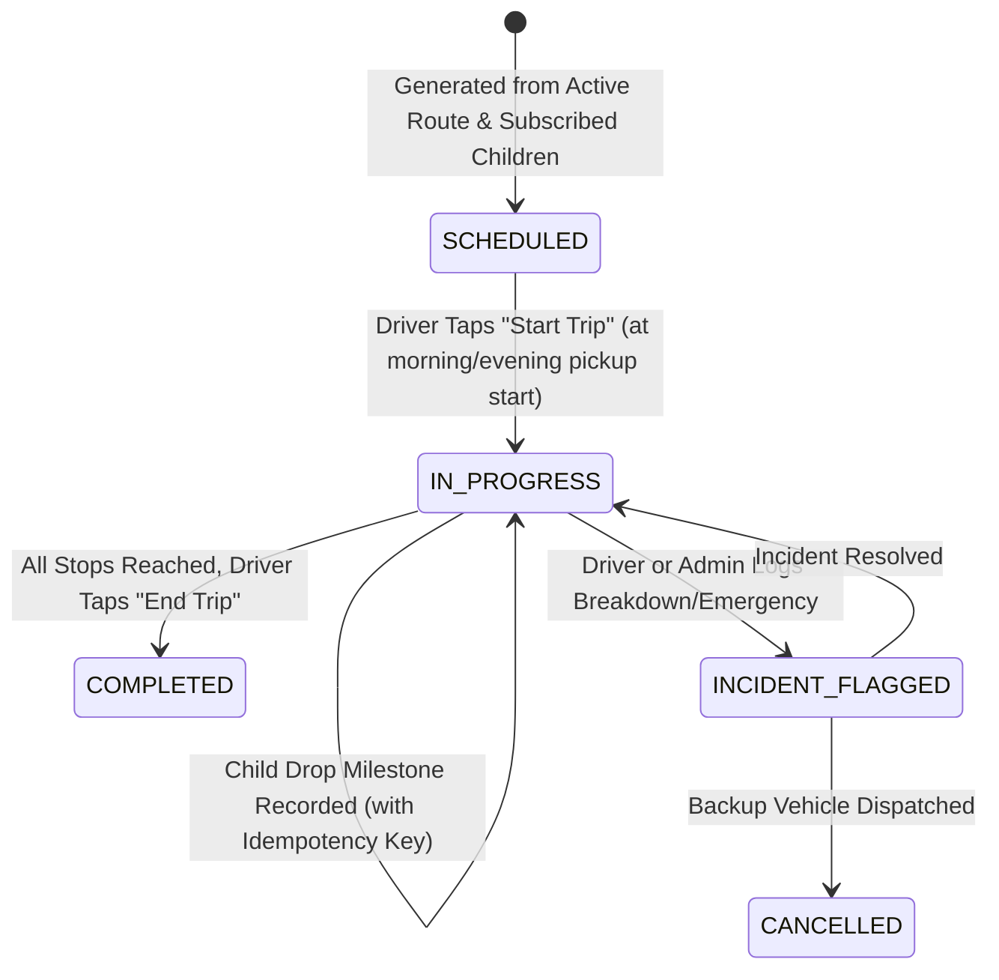

# TinyRide by Dodail — System Architecture Document

**Brand**: TinyRide by Dodail  
**Architecture Version**: 1.0.0  
**Target Pilot**: Hyderabad, Telangana, India  
**Date**: September 2026  

---

## 1. System Overview & Monorepo Structure

TinyRide is engineered as a clean, high-performance monorepo utilizing **pnpm workspaces** and **Turborepo** for unified code sharing, strict type safety, and fast incremental builds.

```
tinyride/
├── apps/
│   ├── parent/            # React Native (Expo Router) mobile app for parents
│   ├── driver/            # React Native (Expo Router) mobile app for drivers
│   └── admin/             # Next.js 15 App Router web app for operations & super admins
├── packages/
│   ├── ui/                # Shared theme, tokens, Tailwind presets & cross-platform primitives
│   ├── types/             # Shared TypeScript interfaces, domain entities, database schemas
│   ├── validation/        # Shared Zod validation schemas (Auth, KYC, Booking, Trips)
│   ├── api-client/        # Shared Supabase API client and typed query hooks
│   └── config/            # Shared ESLint, Prettier, TypeScript, and Tailwind configurations
├── supabase/
│   ├── migrations/        # Sequential PostgreSQL schema migrations (DDL, triggers, RLS)
│   ├── functions/         # Supabase Edge Functions (Deno/TypeScript)
│   │   ├── create-razorpay-order/
│   │   ├── razorpay-webhook/
│   │   ├── send-trip-notification/
│   │   └── ai-support-assistant/
│   ├── seed.sql           # Hyderabad pilot seed data (schools, routes, test vehicles)
│   └── tests/             # Database and RLS validation tests
├── services/
│   └── route-optimizer/   # Google OR-Tools Python route clustering & capacity solver
├── docs/                  # Architecture, plan, assumptions, security & progress docs
├── package.json           # Monorepo root package configuration
├── pnpm-workspace.yaml    # Monorepo workspace mapping
├── turbo.json             # Turbo pipeline tasks (build, lint, test, typecheck)
└── .env.example           # Environment template with client/server credential segregation
```

---

## 2. High-Level Architecture Diagram

```mermaid
flowchart TB
    subgraph Clients["Client Layer"]
        ParentApp["Parent Mobile App\n(Expo / React Native)"]
        DriverApp["Driver Mobile App\n(Expo / React Native)"]
        AdminWeb["Operations Admin Web\n(Next.js 15 App Router)"]
    end

    subgraph EdgeLayer["Edge / API Gateway (Supabase)"]
        AuthService["Supabase Auth\n(OTP Phone / JWT)"]
        EdgeFunctions["Supabase Edge Functions\n(Deno / TypeScript)"]
        Storage["Supabase Storage\n(Encrypted Private KYC/Photos)"]
    end

    subgraph DataLayer["Database Layer (PostgreSQL)"]
        PostgresDB[("PostgreSQL 15+\nRow Level Security (RLS)\nAudit Triggers\nAtomic Transactions")]
    end

    subgraph ExternalServices["External Infrastructure"]
        Razorpay["Razorpay API & Webhooks\n(Orders, Payments, Refunds)"]
        GoogleMaps["Google Maps Platform\n(Geocoding, Routes, Distance Matrix)"]
        PushService["Push Notification Services\n(Expo Notifications / FCM / APNs)"]
        OptimizerService["Route Optimizer Service\n(Google OR-Tools Python)"]
    end

    ParentApp -->|HTTPS / Supabase Client| AuthService
    ParentApp -->|REST / PostgREST| PostgresDB
    ParentApp -->|Invoke Payment| EdgeFunctions

    DriverApp -->|HTTPS / Supabase Client| AuthService
    DriverApp -->|Sync Trip Events| PostgresDB
    DriverApp -->|Upload Documents| Storage

    AdminWeb -->|Next.js Server Actions| PostgresDB
    AdminWeb -->|Signed Document URLs| Storage
    AdminWeb -->|Trigger Optimization| OptimizerService

    EdgeFunctions -->|Verify Signature & Record| PostgresDB
    EdgeFunctions -->|Create Order| Razorpay
    Razorpay -->|Webhook (HMAC-SHA256)| EdgeFunctions
    EdgeFunctions -->|Trigger Push| PushService
    AdminWeb -->|Map Queries| GoogleMaps
```

---

## 3. Core Domain Entities & Relational Schema



---

## 4. State Machines

### 4.1 Driver Verification State Machine


### 4.2 Booking & Payment State Machine


### 4.3 Trip Execution State Machine


---

## 5. Offline Sync & Idempotency Protocol (Driver App)
1. Drivers operate in dense urban pockets with intermittent mobile connectivity.
2. The Driver App caches the day's active schedule, route stops, and authorized passenger list in persistent local storage.
3. Every milestone action generates an immutable local event with:
   - `idempotency_key`: `UUIDv4` generated at client tap.
   - `trip_id`: UUID.
   - `child_id`: UUID.
   - `event_type`: `PICKED_UP` | `DROPPED` | `ABSENT`.
   - `recorded_at`: Local device ISO timestamp.
   - `coordinates`: GPS Lat/Lng at time of button press.
4. When network connectivity is re-established, the sync engine dispatches the queued events via `POST /rpc/sync_trip_events`.
5. PostgreSQL enforces a unique constraint on `(trip_id, child_id, event_type)`. If an event was already processed, the duplicate is ignored cleanly without raising an application crash or firing duplicate push alerts.

---

## 6. Route Optimization Engine (Google OR-Tools)
- Located in `services/route-optimizer`.
- Models the School Bus Routing Problem (SBRP) as a Capacitated Vehicle Routing Problem with Time Windows (CVRPTW).
- Minimizes total fleet transit time and student riding time while enforcing:
  - Vehicle capacity (Auto: 4-6; Van: 8-12).
  - Maximum riding duration per child (< 45 minutes).
  - Bell time pickup and drop-off windows.
- Outputs recommended assignments and stop sequences for human admin review.
- **Strict safety guardrail**: No route modification takes effect automatically without an Operations Admin's explicit approval.
