# TinyRide by Dodail — Master Implementation Plan

**Brand**: TinyRide by Dodail  
**Target Market**: Hyderabad, Telangana, India  
**Version**: 1.0.0  
**Date**: September 2026  

---

## 1. Roadmap & Prioritized Phases

```mermaid
flowchart LR
    P1["Phase 1:\nMonorepo & DB Foundation"] --> P2["Phase 2:\nParent & Child Profiles"]
    P2 --> P3["Phase 3:\nDriver Onboarding & KYC"]
    P3 --> P4["Phase 4:\nRoute Discovery & Booking"]
    P4 --> P5["Phase 5:\nRazorpay Payments"]
    P5 --> P6["Phase 6:\nDriver Trip Ops & Sync"]
    P6 --> P7["Phase 7:\nAdmin Ops Dashboard"]
    P7 --> P8["Phase 8:\nOR-Tools Route Optimizer"]
    P8 --> P9["Phase 9:\nAI Support & Assistive OCR"]
    P9 --> P10["Phase 10:\nHardening & App Store Prep"]
```

---

## 2. Phase Breakdown & Acceptance Criteria

### Phase 1: Repository Foundation, Monorepo Setup & Supabase Database Core
- **Deliverables**:
  - `pnpm` workspaces + `turbo.json` monorepo configuration.
  - Shared TypeScript packages:
    - `@tinyride/types`: Shared domain interfaces, Enums, DB types.
    - `@tinyride/validation`: Zod schemas for auth, profiles, KYC, bookings, trips.
    - `@tinyride/ui`: Brand theme (Navy & Orange), color tokens, base component primitives.
    - `@tinyride/config`: Shared TSConfig, ESLint, Prettier.
  - Complete Supabase PostgreSQL schema migrations:
    - Tables: `profiles`, `parents`, `children`, `schools`, `drivers`, `vehicles`, `driver_documents`, `routes`, `route_stops`, `bookings`, `subscriptions`, `payments`, `driver_payouts`, `trips`, `trip_events`, `incidents`, `support_tickets`, `audit_logs`.
    - PostgreSQL triggers: auto-profile creation on auth signup, updated_at timestamps, audit logging.
    - Row Level Security (RLS) policies enforcing multi-tenant isolation.
  - Hyderabad pilot seed data (`schools`, `test routes`, `test drivers`).
  - Unit and database integration tests.
- **Acceptance Criteria**:
  - Monorepo builds cleanly with `pnpm build`.
  - Typechecks succeed across all packages with zero errors.
  - Supabase migrations apply deterministically and RLS policies prevent unauthorized cross-tenant reads.

### Phase 2: Parent Profile, Child Profiles, Schools & Pickup/Drop Locations
- **Deliverables**:
  - `apps/parent` setup with Expo Router & TypeScript.
  - Parent onboarding screen (Name, emergency contact, alternate phone).
  - Child profile management: add multiple children, select school from verified list, specify grade/section, set home pickup and drop coordinates.
  - Form validation with Zod + React Hook Form.
- **Acceptance Criteria**:
  - Parent can register and add multiple children.
  - Child records are scoped strictly to the authenticated parent.

### Phase 3: Driver Onboarding, Vehicle Registration & Admin KYC Verification
- **Deliverables**:
  - `apps/driver` setup with Expo Router.
  - Driver profile creation (Aadhaar, Commercial DL, badge number, experience).
  - Vehicle registration (Auto vs Van, RC number, FC expiry, Insurance expiry, seating capacity).
  - Document upload to Supabase Storage with document type categorization.
  - Admin KYC verification queue in `apps/admin` (Review, approve, or reject with reason).
- **Acceptance Criteria**:
  - Unverified drivers cannot be assigned to active routes.
  - Uploaded KYC documents are stored in private buckets accessible only via authenticated signed URLs.

### Phase 4: Route Configuration, Discovery, Matching & Seat Reservations
- **Deliverables**:
  - Driver route proposal (Morning/Afternoon stop sequences, pickup windows).
  - Admin route approval & publishing workflow.
  - Parent route discovery screen: search by school, filter by distance, view verified driver profile and vehicle photos.
  - Concurrency-safe seat reservation (pessimistic lock preventing overselling).
  - Immutable fare snapshot stored on booking creation.
- **Acceptance Criteria**:
  - Capacity limit is strictly enforced (Auto: 4-6, Van: 8-12).
  - Parents cannot book seats on unapproved or full routes.

### Phase 5: Razorpay Payment Integration & Subscriptions
- **Deliverables**:
  - Supabase Edge Function `create-razorpay-order`: calculates monthly subscription fee, generates order.
  - Parent app checkout integration with Razorpay SDK/modal.
  - Supabase Edge Function `razorpay-webhook`: validates HMAC-SHA256 signature, records payment transaction, activates booking and subscription.
  - Idempotent webhook handling (duplicate webhooks handled without side effects).
- **Acceptance Criteria**:
  - No client-side payment confirmation is trusted.
  - Tampered webhook signatures are rejected with 401.

### Phase 6: Driver Trip Execution, Offline Sync & Milestone Notifications
- **Deliverables**:
  - Driver daily schedule dashboard (Morning / Afternoon rosters).
  - Two-tap trip management UI: "Start Trip", "Picked Up", "Dropped Off", "End Trip".
  - Offline event queue with UUID idempotency keys and automatic retry upon network restoration.
  - Supabase Edge Function `send-trip-notification` dispatching push notifications to parents.
- **Acceptance Criteria**:
  - Driver cannot start trip if suspended.
  - Repeated button taps send identical idempotency keys and do not duplicate events.

### Phase 7: Next.js Operations Admin Dashboard
- **Deliverables**:
  - `apps/admin` Next.js 15 App Router application with Tailwind CSS.
  - Overview metrics (Active children, verified drivers, active routes, daily trip completion rate).
  - Driver & Vehicle verification desk with signed document viewer.
  - Live Trip Monitoring board.
  - Incident management & escalation workflow.
  - Financial ledger & driver payout tracking.
- **Acceptance Criteria**:
  - Role-scoped server action checks ensure non-admins cannot mutate operational states.
  - Every admin action writes to `audit_logs`.

### Phase 8: Google OR-Tools Route Optimization Service
- **Deliverables**:
  - Python microservice `services/route-optimizer` using Google OR-Tools CVRPTW solver.
  - Input ingestion (School bell times, student home coordinates, vehicle capacities).
  - Stop sequence optimization minimizing total student travel time.
  - Admin proposal view: interactive preview of suggested routes before approval.
- **Acceptance Criteria**:
  - Generated routes honor vehicle seat limits and max student travel time constraints.
  - Route recommendations require admin sign-off before becoming active.

### Phase 9: AI Support Assistant & Assistive Document OCR
- **Deliverables**:
  - Constrained LLM Edge Function `ai-support-assistant` with authenticated context and strict system prompts.
  - Assistive OCR extraction for driver DL and RC numbers (suggestion only; admin confirms).
- **Acceptance Criteria**:
  - Assistant answers only from verified company policy and user booking records; never fabricates trip status.

### Phase 10: Security Hardening, App Store & Play Store Preparation
- **Deliverables**:
  - EAS configuration (`eas.json`), bundle identifiers (`com.dodail.tinyride.parent`, `com.dodail.tinyride.driver`).
  - Privacy policy, permissions disclosures, account deletion workflow.
  - End-to-end automated test suites.

---

## 3. Immediate Vertical Slice (Phase 1 Focus)
The immediate deliverable is **Phase 1: Monorepo Setup, Shared Packages, Supabase Foundation, Database Migrations, RLS, and Test Suite**:
1. Monorepo root setup (`package.json`, `pnpm-workspace.yaml`, `turbo.json`, `.gitignore`, `.env.example`).
2. Shared packages: `@tinyride/types`, `@tinyride/validation`, `@tinyride/ui`, `@tinyride/config`.
3. Complete Supabase SQL migration files covering all 18+ domain tables, foreign keys, triggers, audit logging, and comprehensive Row Level Security policies.
4. Hyderabad pilot seed data.
5. Unit tests validating schema validation, types, and security constraints.
